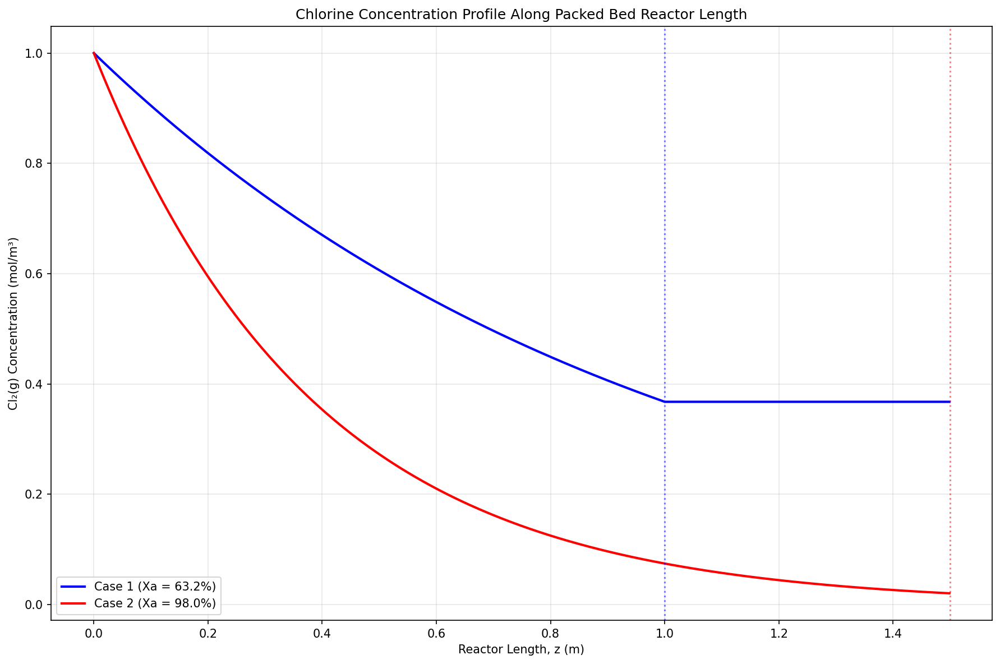

This project presents a high-performance simulation of chlorine gas removal in a PBR using Intel's oneAPI SYCL framework and dpctl Python package. Leveraging heterogeneous computing across CPUs, GPUs, and FPGAs, the simulation models external diffusion-limited Cl₂ absorption. Key features include GPU-accelerated tensor operations on large grids (50,000 points), flexible device management via dpctl's device query system, and seamless integration with NumPy and Matplotlib for rapid prototyping and visualization. 

The implementation combines numerical Euler method solutions and analytical concentration profiles, validated against theoretical models, with a scalable design poised for future enhancements like fully parallelized SYCL kernel offloading.

 

The model simulates a Packed Bed Reactor (PBR) designed to remove chlorine gas (Cl₂) from a waste gas stream using solid absorbent granules. This reaction is external diffusion-limtied, where the rate of Cl₂ removal is controlled by mass transfer from the bulk gas to the absorbent surface. Chlorine flows through a tubular reactor at a superficial velocity determined by the volumetric flow rate, diffusing to the absorbent granule surfaces with a mass transfer coefficient kc. The instantaneous surface reaction (CAs ≈ 0) causes an exponential decrease in Cl₂ concentration along the reactor length. 

Several key assumptions were made to simplify the model and focus on the external diffusion-limited process. Steady-state operation assumes constant flow and unchanging conditions over time, eliminating transient effects. Isothermal conditions mean the reactor maintains a uniform temperature, avoiding thermal gradients that could affect reaction rates. The reactor is assumed to be uniformly packed with spherical absorbent particles, characterized by a consistent porosity of ϕ = 0.4, which ensures predictable gas flow and surface area distribution. Negligible axial diffusion implies that Cl₂ transport along the reactor length occurs primarily by convection, not diffusion, simplifying the overall mass balance.

 

**Formula Section**
(not complete yet):
---
The concentration profile for species A in the reactor is given by:

$$\frac{C_A}{C_{A0}} = (1 - X_A) = \exp\left(-\frac{k_c a_c z}{u}\right)$$

- **CA**: Concentration of Cl₂ at position z in the reactor (mol/m³).
- **CA0**: Initial Cl₂ concentration at the reactor inlet (mol/m³, typically 1.0 mol/m³).
- **XA**: Conversion of Cl₂, representing the fraction of Cl₂ removed (dimensionless, e.g., 0.632 for Case 1, 0.98 for Case 2).
- **kc**: Mass transfer coefficient, quantifying the rate of Cl₂ diffusion to the absorbent surface (m/s).
- **av**: External surface area of absorbent particles per unit reactor volume (m²/m³).
- **z**: Axial position along the reactor length (m, ranging from 0 to 1.5 m).
- **u**: Superficial gas velocity, proportional to the volumetric flow rate (m/s, e.g., 0.1 m/s for Case 1, 0.4 m/s for Case 2).

---
The governing numerical differential equation:

$$-u \frac{dC_A}{dz} = k_c a_c C_A$$

- **u**: Superficial gas velocity (m/s), as defined above.
- **CA**: Cl₂ concentration at position z (mol/m³), as defined above.
- **dCA/dz**: Rate of change of Cl₂ concentration along the reactor length (mol/m⁴).
- **kc**: Mass transfer coefficient (m/s), as defined above.
- **av**: External surface area per unit reactor volume (m²/m³), as defined above.

---
Numerical solution using Euler's method:

$$C[i] = C[i-1] - \frac{k_c a_c}{u} C[i-1] dz$$

Grid spacing is defined as:

$$dz = \frac{z}{N-1}$$

Where z is the reactor length of 1.5 m and N = 50,000 (grid points)

 

The mass transfer coefficient is calculated using:

$$k_c = 0.6 \frac{D_{AB}^{2/3}}{v^{1/6}} \frac{u^{1/2}}{d_p^{1/2}}$$

The external surface area per unit volume is given by:

$$a_c = \frac{6(1-\phi)}{d_p}$$

Where: $\phi$ is the void fraction (porosity) and $d_p$ is the particle diameter

